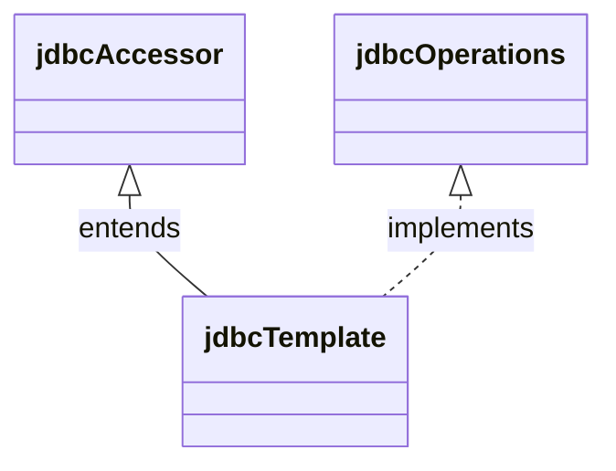
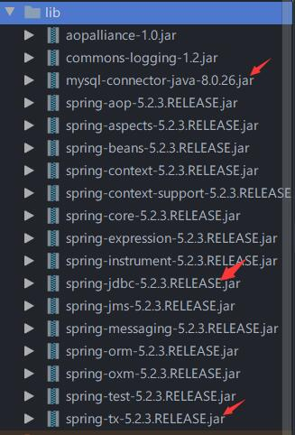
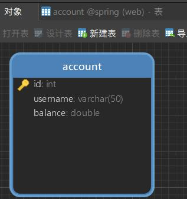
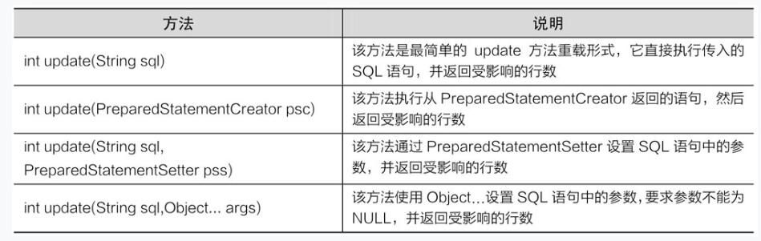
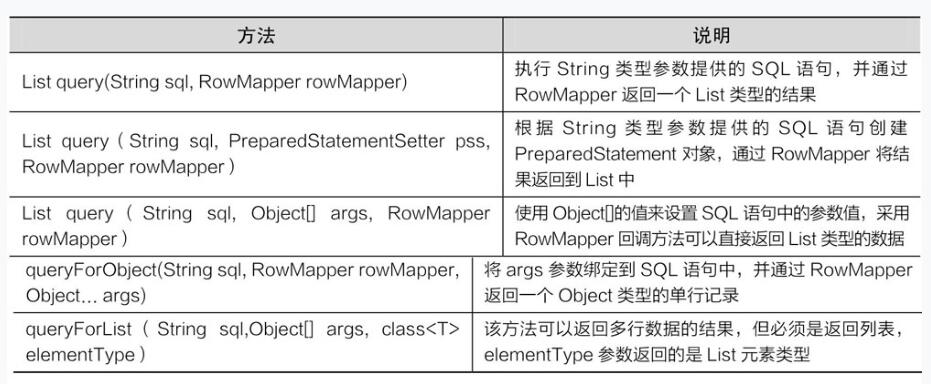

# 4 Spring的数据库开发

`学习目标`

- 了解Spring中JDBC模块的作用

- 熟悉Spring JDBC的配置

- 掌握JdbcTemplate类中几个常用方法的使用

# 4.1 Spring JDBC

>  Spring的JDBC模块负责数据库资源管理和错误处理，大大简化了开发人员对数据库的操作，使得开发人员可以从繁琐的数据库操作中解脱出来，从而将更多的精力投入到编写业务逻辑当中。

## 4.1.1 Spring JdbcTemplate的解析

> 针对数据库的操作，Spring框架提供了JdbcTemplate类，该类是Spring框架数据抽象层的基础，其他更高层次的抽象类却是构建于JdbcTemplate类之上。

> 可以说，JdbcTemplate类是Spring JDBC的核心类。JdbcTemplate类的继承关系十分简单。它继承自抽象类JdbcAccessor，同时实现了JdbcOperations接口，如图所示。



`jdbcTemplate`类的父类`JdbcAccessor`，该类为子类提供了一些访问数据库时使用的公共属性：

- `DataSourse`：其主要功能是获取数据库连接，具体实现时还可以引入对数据库连接的缓冲池和分布式事务的支持，它可以作为访问数据库资源的标准接口。
- SQLExceptionTranslator:org.springframework.jdbc.support.`SQLExceptionTranslator`接口负责对SQLException进行转译工作。通过必要的设置或者获取SQLExceptionTranslator中的方法，可以使JdbcTemplate在需要处理SQLException时，委托SQLExceptionTranslator的实现类来完成相关的转译工作。

`JdbcOperations`接口

- 定义了在JdbcTemplate类中可以使用的操作集合，包括添加、修改、查询和删除等操作。

## 4.1.2 Spring JDBC的配置

Spring JDBC模块主要由4个包组成，分别是core（核心包）、dataSource（数据源包）、object（对象包）和support（支持包）

| 包名       | 作用                                                         |
| ---------- | ------------------------------------------------------------ |
| core       | 包含了JDBC的核心功能，包括jdbcTemplate类，SimpleJdbcInsert类、SimpleJdbcCall类以及NamedParameterJdbcTemplate类 |
| dataSourse | 访问数据源的实用工具类，它有多种数据源的实现，可以在JavaEE容器外部测试JDBC代码 |
| object     | 以面向对象的方式访问数据库，它允许执行查询并将返回结果作为业务对象，可以在数据表的列和业务对象的属性之间映射查询结果 |
| support    | 包含了core和object包的支持类，例如，提供异常转换功能的SQLException类 |

Spring对数据库的操作都封装在了这几个包中，而想要使用Spring JDBC，就需要对其进行配置。在Spring中，JDBC的配置是在配置文件applicationContext.xml中完成的，其配置模板下所示。

```xml
<?xml version="1.0" encoding="UTF-8"?>
<beans xmlns="http://www.springframework.org/schema/beans"
       xmlns:xsi="http://www.w3.org/2001/XMLSchema-instance"
       xsi:schemaLocation="http://www.springframework.org/schema/beans
 	http://www.springframework.org/schema/beans/spring-beans-4.3.xsd">
    <!--    1配置数据源-->
    <bean id="dataSource" class="org.springframework.jdbc.datasource.DriverManagerDataSource">
        <!--        数据库驱动(需用导入mysql-connector-java包)-->
        <property name="driverClassName" value="com.mysql.jdbc.Driver"/>
        <!--        连接数据的url-->
        <property name="url" value="jdbc:mysql//localhost:3306/spring"/>
        <!--        连接数据库的用户名-->
        <property name="username" value="root"/>
        <!--        连接数据库的密码-->
        <property name="password" value="123456"/>
    </bean>
    <!--        2配置JDBC模板-->
    <bean id="jdbcTemplate" class="org.springframework.jdbc.core.JdbcTemplate">
        <property name="dataSource" ref="dataSource"/>
    </bean>
    <!--    3配置注入类-->
    <bean id="xxx" class="Xxx">
        <property name="jdbcTemplate" ref="jdbcTemplate/"
    </bean>
</beans>
```

🎯分析配置代码：

- 需要定义3个Bean，分别是`dataSource`、`jdbcTemplate`和`需要注入的Bean`(Dao)
- 其中`dataSource`对应的org.springframework.jdbc.datasource.DriverManagerDataSource类用于对数据源进行配置，重点配置其`driverClassName、url、username、password`属性。`jdbcTemplate`对应的org.springframework.jdbc.core.JdbcTemplate类中定义了JdbcTemplate的相关配置。
- 定义jdbcTemplate时，需要将dataSource注入到jdbcTemplate中，而其他需要使用jdbcTemplate的Bean，也需要将jdbcTemplate注入到该Bean中（通常注入到Dao类中，在Dao类中进行与数据库的相关操作）。

🎯注意：

> `dataSource`中配置的4个属性，需要根据数据库类型或者机器配置的不同设置相应的属性值。例如，如果数据库类型不同，需要更改驱动名称；如果数据库不在本地，则需要将地址中的localhost替换成相应的主机IP；如果修改过MySQL数据库的端口号（默认为3306），则需要加上修改后的端口号，如果未修改，则端口号可以省略；同时连接数据库的用户名和密码需要与数据库创建时设置的用户名和密码保持一致。

# 4.2 Spring JdbcTemplate的常用方法

> 在`JdbcTemplate`类中，提供了大量的更新和查询数据库的方法，我们就是使用这些方法来操作数据库的。

- execute()
  - execute(String sql)方法可用于执行sql语句
- update()
  - update()用于执行插入、更新和删除
- query()
  - query()用于执行数据查询操作

## 4.2.1 execute()

> 🎯示例：使用MySQL创建一个spring数据库，使用jdbcTemplate的execute方法创建一个account表。

✈操作步骤：

1. 在MySQL中，创建一个名为spring的数据库。

2. 创建web项目，将运行Spring框架所需的5个基础JAR包、MySQL数据库的驱动JAR包、Spring JDBC的JAR包以及Spring事务处理的JAR包复制到项目的lib目录，并发布到类路径中。

   

3. 在src目录下，创建配置文件`applicationContext.xml`，在该文件中配置id为dataSource的数据源Bean和id为jdbcTemplate的JDBC模板Bean，并将数据源注入到JDBC模板中。

   ```xml
   <?xml version="1.0" encoding="UTF-8"?>
   <beans xmlns="http://www.springframework.org/schema/beans"
          xmlns:xsi="http://www.w3.org/2001/XMLSchema-instance"
          xsi:schemaLocation="http://www.springframework.org/schema/beans
    	http://www.springframework.org/schema/beans/spring-beans-4.3.xsd">
       <!--    1配置数据源-->
       <bean id="dataSource" class="org.springframework.jdbc.datasource.DriverManagerDataSource">
           <!--        数据库驱动-->
           <property name="driverClassName" value="com.mysql.jdbc.Driver"/>
           <!--        连接数据的url-->
           <property name="url" value="jdbc:mysql://localhost:3306/spring"/>
           <!--        连接数据库的用户名-->
           <property name="username" value="root"/>
           <!--        连接数据库的密码-->
           <property name="password" value="123456"/>
       </bean>
       <!--        2配置JDBC模板-->
       <bean id="jdbcTemplate" class="org.springframework.jdbc.core.JdbcTemplate">
           <property name="dataSource" ref="dataSource"/>
       </bean>
   </beans>
   ```

4. 在src目录下，创建一个com.junhao.jdbc包，在该包中创建测试类JdbcTemplateTest。在该类的main()方法中通过Spring容器获取在配置文件中定义的JdbcTemplate实例，然后使用该实例的execute(String sql)方法执行创建数据表的SQL语句。

   ```java
   package com.junhao.jdbc;
   
   import org.springframework.context.ApplicationContext;
   import org.springframework.context.support.ClassPathXmlApplicationContext;
   import org.springframework.jdbc.core.JdbcTemplate;
   
   public class jdbcTemplateTest {
       public static void main(String[] args) {
           ApplicationContext applicationContext = new ClassPathXmlApplicationContext("applicationContext.xml");
           JdbcTemplate jdbcTemplate = (JdbcTemplate) applicationContext.getBean("jdbcTemplate");
           jdbcTemplate.execute("create table account(" +
                   "id int primary key auto_increment," +
                   "username varchar(50)," +
                   "balance double)");
           System.out.println("账户表account创建成功！");
   
       }
   }
   ```

   ```bash
   账户表account创建成功！
   ```

   

🎯补充：使用单元测试

在软件开发过程中，需要有相应的测试工作。依据测试目的不同，可以将软件测试分为`单元测试、集成测试、确认测试和系统测试`等。其中单元测试在软件开发阶段是最底层的测试，它易于及时发现并解决问题。`JUnit`就是一个进行单元测试的开源框架。

```java
import org.junit.Test;
	//在方法上添加单元测试的注解@Test
	//@Test就是Junit4用于测试的注解，要测试哪个方法，只需要在相应测试的方法上添加此注解即可。当在需要测试的方法上添加@Test注解,并导入JUnir包
	@Test
    public void mainTest() {
        ApplicationContext applicationContext = new ClassPathXmlApplicationContext("applicationContext.xml");
        JdbcTemplate jdbcTemplate = (JdbcTemplate) applicationContext.getBean("jdbcTemplate");
        jdbcTemplate.execute("create table account1(" +
                "id int primary key auto_increment," +
                "username varchar(50)," +
                "balance double)");
        System.out.println("账户表account创建成功！");

    }
```

## 4.2.2 update()

> update()方法可以完成插入、更新和删除数据的操作。在JdbcTemplate类中，提供了一系列的update()方法。



> 🎯  用户管理案例

✈操作步骤：

1. 在com.junhao.jdbc包中创建Account类，在该类中定义id、username和balance属性，以及其对应的getter/setter方法。

   ```java
   package com.junhao.jdbc;
   
   public class Account {
       private Integer id;       // 账户id
       private String username; // 用户名
       private Double balance;  // 账户余额
   
       public Integer getId() {
           return id;
       }
   
       public void setId(Integer id) {
           this.id = id;
       }
   
       public String getUsername() {
           return username;
       }
   
       public void setUsername(String username) {
           this.username = username;
       }
   
       public Double getBalance() {
           return balance;
       }
   
       public void setBalance(Double balance) {
           this.balance = balance;
       }
   
       public String toString() {
           return "Account [id=" + id + ", "
                   + "username=" + username +
                   ", balance=" + balance + "]";
       }
   }
   ```

2. 在com.junhao.jdbc包中，创建接口AccountDao，并在接口中定义添加、更新和删除账户的方法

   ```java
   package com.junhao.jdbc;
   
   import java.util.List;
   
   public interface AccountDao {
       // 添加
       public int addAccount(Account account);
   
       // 更新
       public int updateAccount(Account account);
   
       // 删除
       public int deleteAccount(int id);
   
       // 通过id查询
       public Account findAccountById(int id);
   
       // 查询所有账户
       public List<Account> findAllAccount();
   }
   
   ```

3. 在com.junhao.jdbc包中，创建AccountDao接口的实现类AccountDaoImpl，并在类中实现添加、更新和删除账户的方法。

   ```java
   package com.junhao.jdbc;
   
   import org.springframework.jdbc.core.JdbcTemplate;
   
   import java.util.List;
   
   import org.springframework.jdbc.core.BeanPropertyRowMapper;
   import org.springframework.jdbc.core.RowMapper;
   
   public class AccountDaoImpl implements AccountDao {
       // 声明JdbcTemplate属性及其setter方法
       private JdbcTemplate jdbcTemplate;
   
       public void setJdbcTemplate(JdbcTemplate jdbcTemplate) {
           this.jdbcTemplate = jdbcTemplate;
       }
   
       // 添加账户
       public int addAccount(Account account) {
           // 定义SQL
           String sql = "insert into account(username,balance) value(?,?)";
           // 定义数组来存放SQL语句中的参数
           Object[] obj = new Object[]{
                   account.getUsername(),
                   account.getBalance()
           };
           // 执行添加操作，返回的是受SQL语句影响的记录条数
           int num = this.jdbcTemplate.update(sql, obj);
           return num;
       }
   
       // 更新账户
       public int updateAccount(Account account) {
           // 定义SQL
           String sql = "update account set username=?,balance=? where id = ?";
           // 定义数组来存放SQL语句中的参数
           Object[] params = new Object[]{
                   account.getUsername(),
                   account.getBalance(),
                   account.getId()
           };
           // 执行添加操作，返回的是受SQL语句影响的记录条数
           int num = this.jdbcTemplate.update(sql, params);
           return num;
       }
   
       // 删除账户
       public int deleteAccount(int id) {
           // 定义SQL
           String sql = "delete  from account where id = ? ";
           // 执行添加操作，返回的是受SQL语句影响的记录条数
           int num = this.jdbcTemplate.update(sql, id);
           return num;
       }
   }
   
   ```

4. 在applicationContext.xml中，定义一个id为accountDao的Bean，该Bean用于将jdbcTemplate注入到accountDao实例中。

   ```xml
   <?xml version="1.0" encoding="UTF-8"?>
   <beans xmlns="http://www.springframework.org/schema/beans"
          xmlns:xsi="http://www.w3.org/2001/XMLSchema-instance"
          xsi:schemaLocation="http://www.springframework.org/schema/beans
    	http://www.springframework.org/schema/beans/spring-beans-4.3.xsd">
       <!--    1配置数据源-->
       <bean id="dataSource" class="org.springframework.jdbc.datasource.DriverManagerDataSource">
           <!--        数据库驱动-->
           <property name="driverClassName" value="com.mysql.jdbc.Driver"/>
           <!--        连接数据的url-->
           <property name="url" value="jdbc:mysql://localhost:3306/spring"/>
           <!--        连接数据库的用户名-->
           <property name="username" value="root"/>
           <!--        连接数据库的密码-->
           <property name="password" value="123456"/>
       </bean>
       <!--        2配置JDBC模板-->
       <bean id="jdbcTemplate" class="org.springframework.jdbc.core.JdbcTemplate">
           <property name="dataSource" ref="dataSource"/>
       </bean>
       <!--    3配置注入类-->
       <bean id="accountDao" class="com.junhao.jdbc.AccountDaoImpl">
           <property name="jdbcTemplate" ref="jdbcTemplate"/>
       </bean>
   
   </beans>
   ```

5. 在测试类JdbcTemplateTest中，添加测试方法。

   ```java
   package com.junhao.jdbc;
   
   import org.junit.Test;
   import org.springframework.context.ApplicationContext;
   import org.springframework.context.support.ClassPathXmlApplicationContext;
   import org.springframework.jdbc.core.JdbcTemplate;
   
   import java.util.List;
   
   public class jdbcTemplateTest {
       public static void main(String[] args) {
           ApplicationContext applicationContext = new ClassPathXmlApplicationContext("applicationContext.xml");
           JdbcTemplate jdbcTemplate = (JdbcTemplate) applicationContext.getBean("jdbcTemplate");
           jdbcTemplate.execute("create table account(" +
                   "id int primary key auto_increment," +
                   "username varchar(50)," +
                   "balance double)");
           System.out.println("账户表account创建成功！");
   
       }
   
       @Test
       public void mainTest() {
           ApplicationContext applicationContext = new ClassPathXmlApplicationContext("applicationContext.xml");
           JdbcTemplate jdbcTemplate = (JdbcTemplate) applicationContext.getBean("jdbcTemplate");
           jdbcTemplate.execute("create table account1(" +
                   "id int primary key auto_increment," +
                   "username varchar(50)," +
                   "balance double)");
           System.out.println("账户表account创建成功！");
   
       }
   
       @Test
       public void addAccountTest() {
           // 加载配置文件
           ApplicationContext applicationContext =
                   new ClassPathXmlApplicationContext("applicationContext.xml");
           // 获取AccountDao实例
           AccountDao accountDao =
                   (AccountDao) applicationContext.getBean("accountDao");
           // 创建Account对象，并向Account对象中添加数据
           Account account = new Account();
           account.setUsername("tom");
           account.setBalance(1000.00);
           // 执行addAccount()方法，并获取返回结果
           int num = accountDao.addAccount(account);
           if (num > 0) {
               System.out.println("成功插入了" + num + "条数据！");
           } else {
               System.out.println("插入操作执行失败！");
           }
       }
   
       @Test
       public void updateAccountTest() {
           // 加载配置文件
           ApplicationContext applicationContext =
                   new ClassPathXmlApplicationContext("applicationContext.xml");
           // 获取AccountDao实例
           AccountDao accountDao =
                   (AccountDao) applicationContext.getBean("accountDao");
           // 创建Account对象，并向Account对象中添加数据
           Account account = new Account();
           account.setId(1);
           account.setUsername("tom");
           account.setBalance(2000.00);
           // 执行updateAccount()方法，并获取返回结果
           int num = accountDao.updateAccount(account);
           if (num > 0) {
               System.out.println("成功修改了" + num + "条数据！");
           } else {
               System.out.println("修改操作执行失败！");
           }
       }
   
       @Test
       public void deleteAccountTest() {
           // 加载配置文件
           ApplicationContext applicationContext =
                   new ClassPathXmlApplicationContext("applicationContext.xml");
           // 获取AccountDao实例
           AccountDao accountDao =
                   (AccountDao) applicationContext.getBean("accountDao");
           // 执行deleteAccount()方法，并获取返回结果
           int num = accountDao.deleteAccount(1);
           if (num > 0) {
               System.out.println("成功删除了" + num + "条数据！");
           } else {
               System.out.println("删除操作执行失败！");
           }
       }
   }
   
   ```

6. 依次运行测试方法，可以对account实现增删改操作。


## 4.2.3 query()

> JdbcTemplate类中还提供了大量的query()方法来处理各种对数据库表的查询操作。



> 🎯查询示例

✈操作步骤：

1. 向数据表account中插入几条数据（也可以使用数据库图形化工具手动向表中插入数据），插入后account表中的数据。

   ```sql
   INSERT INTO `spring`.`account` (`id`, `username`, `balance`) VALUES (1, 'tom', 2000);
   INSERT INTO `spring`.`account` (`id`, `username`, `balance`) VALUES (2, 'amy', 1000);
   INSERT INTO `spring`.`account` (`id`, `username`, `balance`) VALUES (3, 'bob', 5000);
   INSERT INTO `spring`.`account` (`id`, `username`, `balance`) VALUES (4, 'mike', 4000);
   ```

2. 在AccountDao中，分别创建一个通过id查询单个账户和查询所有账户的方法。

   ```java
       // 通过id查询
       public Account findAccountById(int id);
   
       // 查询所有账户
       public List<Account> findAllAccount();
   ```

3. 在AccountDao接口的实现类AccountDaoImpl中，实现接口中的方法，并使用query()方法分别进行查询。

   ```java
   // 通过id查询账户数据信息
       public Account findAccountById(int id) {
           //定义SQL语句
           String sql = "select * from account where id = ?";
           // 创建一个新的BeanPropertyRowMapper对象
           RowMapper<Account> rowMapper =
                   new BeanPropertyRowMapper<Account>(Account.class);
           // 将id绑定到SQL语句中，并通过RowMapper返回一个Object类型的单行记录
           return this.jdbcTemplate.queryForObject(sql, rowMapper, id);
       }
   
       // 查询所有账户信息
       public List<Account> findAllAccount() {
           // 定义SQL语句
           String sql = "select * from account";
           // 创建一个新的BeanPropertyRowMapper对象
           RowMapper<Account> rowMapper =
                   new BeanPropertyRowMapper<Account>(Account.class);
           // 执行静态的SQL查询，并通过RowMapper返回结果
           return this.jdbcTemplate.query(sql, rowMapper);
       }
   ```

   🎯注意：

   > 在上面两个方法代码中，BeanPropertyRowMapper是RowMapper接口的实现类，它可以自动地将数据表中的数据映射到用户自定义的类中（前提是用户自定义类中的字段要与数据表中的字段相对应）。创建完BeanPropertyRowMapper对象后，在findAccountById()方法中通过queryForObject()方法返回了一个Object类型的单行记录，而在findAllAccount()方法中通过query()方法返回了一个结果集合。

4. 在测试类JdbcTemplateTest中，添加一个测试方法findAccountByIdTest()来测试条件查询。

   ```java
    @Test
       public void findAccountByIdTest() {
           // 加载配置文件
           ApplicationContext applicationContext =
                   new ClassPathXmlApplicationContext("applicationContext.xml");
           // 获取AccountDao实例
           AccountDao accountDao =
                   (AccountDao) applicationContext.getBean("accountDao");
           // 执行findAccountById()方法
           Account account = accountDao.findAccountById(1);
           System.out.println(account);
       }
   
       @Test
       public void findAllAccountTest() {
           // 加载配置文件
           ApplicationContext applicationContext =
                   new ClassPathXmlApplicationContext("applicationContext.xml");
           // 获取AccountDao实例
           AccountDao accountDao =
                   (AccountDao) applicationContext.getBean("accountDao");
           // 执行findAllAccount()方法,获取Account对象的集合
           List<Account> account = accountDao.findAllAccount();
           // 循环输出集合中的对象
           for (Account act : account) {
               System.out.println(act);
           }
       }
   ```

   ```bash
   Account [id=1, username=tom, balance=2000.0]
   Account [id=2, username=amy, balance=1000.0]
   Account [id=3, username=bob, balance=5000.0]
   Account [id=4, username=mike, balance=4000.0]
   ```


# 小结

> 本章对Spring框架中使用JDBC进行数据操作的知识进行了详细讲解。首先讲解了Spring JDBC中的核心类以及如何在Spring中配置JDBC，然后通过案例讲解了Spring JDBC核心类JdbcTemplate中常用方法的使用。通过本章的学习，读者能够学会如何使用Spring框架进行数据库开发，并能深切地体会到Spring框架的强大。


